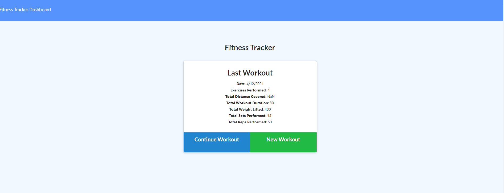

# FITNESS TRACKER

This web application allows a track his workout: 
  - The user can view, create and track daily workouts. 
  - The use is able to log multiple exercises in a workout on a given day. 
  
The following image give an oveview of the application's interface:

## Deployed link

[Fitness Tracker](https://the-fitness-tracker-app.herokuapp.com/?id=6073ca50ccc6330015328ccb)

## Prerequisites

This software can be used on :

- Google Chrome
- Microsoft Edge
- Firefox
  It hasn't been tested on other browsers but it might works properly.

## Author

- [@carlastjuste](http://github.com/carlastjuste)

## License

This project is licensed under the MIT License - see the LICENSE.md file for details
